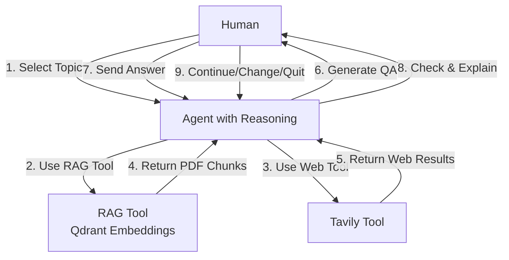

# NPTE Agent with Simplified Tool-Belt



## Simplified Agent with Tool-Belt

### **Agent's Tool-Belt:**
- **RAG Tool** - Qdrant embeddings (your PDFs)
- **Web Tool** - Tavily for current medical literature
- **General Knowledge** - Built-in LLM knowledge

### **Agent's Process:**
```
For each request:
├── Use RAG tool (get PDF context)
├── Use web tool (get current literature)
├── Combine contexts
└── Generate MCQ with A,B,C,D format
```

### **Flow:**
1. **Human** selects topic → **Agent**
2. **Agent** uses RAG tool → Gets PDF context
3. **Agent** uses web tool → Gets current literature
4. **Agent** combines contexts → Generates MCQ
5. **Agent** generates QA → **Human**
6. **Human** sends answer → **Agent**
7. **Agent** checks & explains → **Human**
8. **Human** decides next action → **Agent**

### **Key Features:**
- **Simple tool usage** - RAG + Web for all topics
- **A,B,C,D format** - Standard MCQ format
- **Combined contexts** - PDF + current literature
- **Human control** - All decisions

---

## Future Enhancements:

### **When you have performance data:**
- **Track retrieval performance** per topic
- **Compare RAG vs Cohere** results
- **Add intelligent tool selection** based on data
- **Implement hybrid retrieval** for complex topics

### **For now:**
- **Use RAG for all topics** (simpler, works well)
- **Add web search** for current content
- **Focus on MCQ quality** with A,B,C,D format 